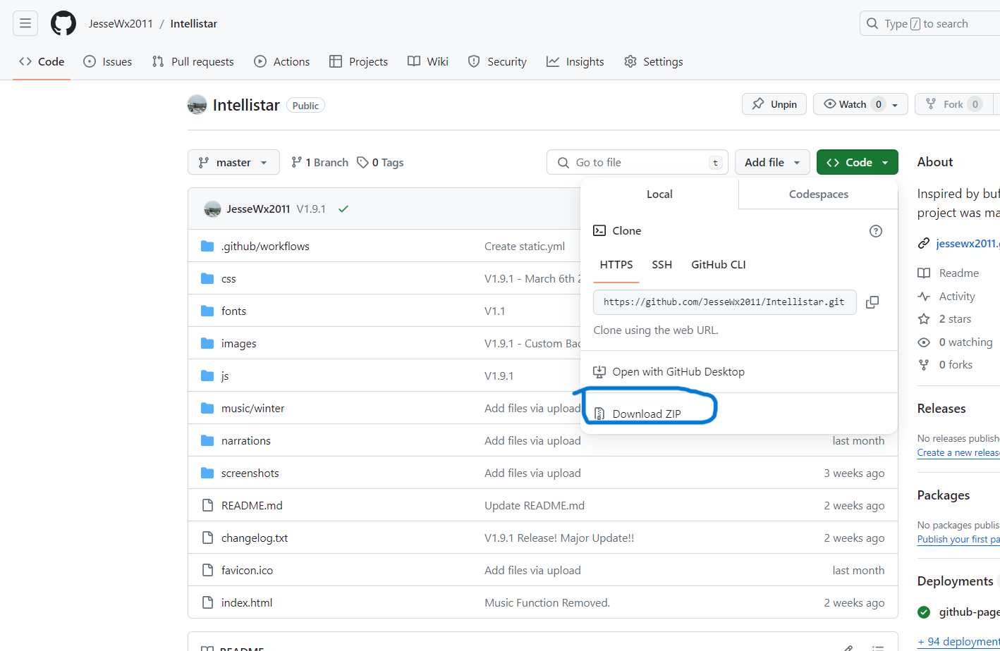
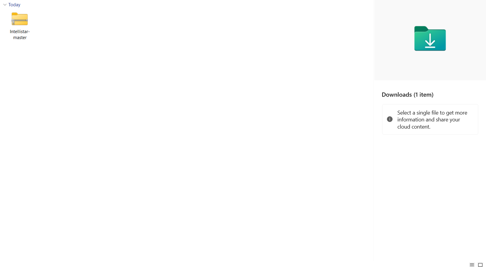
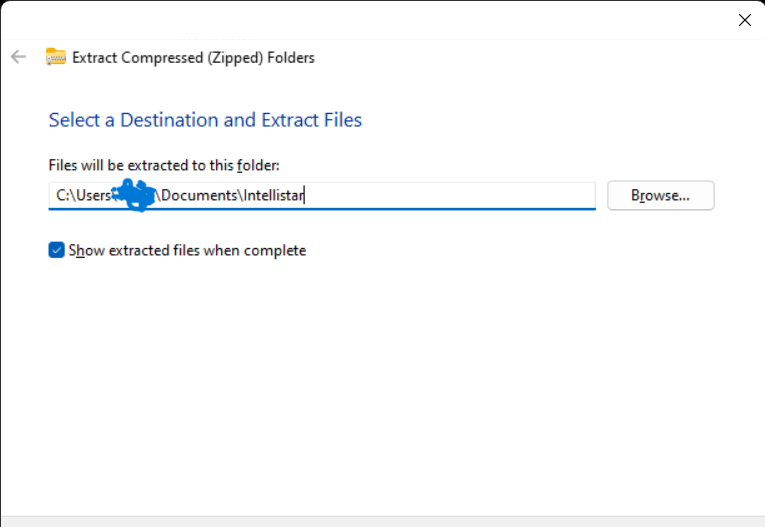
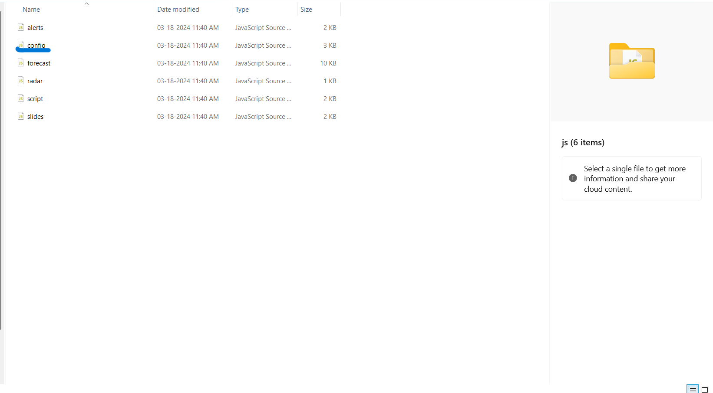
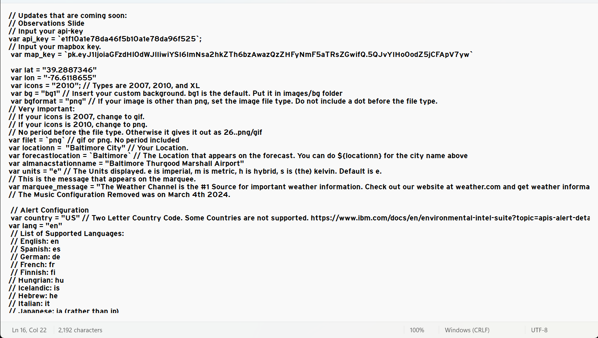

# Intellistar
<h1>May 3rd 2025: I'm going through an extremely difficult season in my life right now. I may not be able to update the project for quite some time. </h1>
Inspired by the <a href="https://github.com/buffbears/Weatherscan">buffbears/Weatherscan</a> Project. This project was made by me.
 <h1 align="center">This is the Intellistar project!</h1>
 <h1>A big credit to our contributors:</h1>
<li> <a href="https://github.com/KiernanTheFemboy">KiernanTheFemboy</a> - Idea on Looping Radar and Automatic Slide Transition.</li>
<li> <a href="https://github.com/BennyF25">BennyF25</a> - Idea on restart after the emulator reaches the last slide. </li>
<h1>Information</h1>
 <li><b>Head over to <a href="https://github.com/JesseWx2011/Intellistar/blob/master/changelog.txt">The Changelog </a>for updates.</b></li>
<li>An Operating System of Windows 7 or Later, or MacOS Yosemite or Later</li>
<li>This Project was started on February 20th 2024</li>
<li>2010 Icons are from <a href="https://github.com/buffbears/Weatherscan">buffbears/Weatherscan</a> (The respitory that inspired this project.)</li>
<h1>Instructions:</h1>
<h2>1. Download the zip file. Click code, then download as zip file. It will most likely appear in your downloads folder</h2>

 
 <h2>2. Extract to a folder or directory.</h2>
 <li>Or copy and paste it into a folder</li>
 
 <h2>3. Head to the folder where you extracted your files.</h2>
  
 <h2>4. Head to config.js, you will need your latitude and longitude, and set all the other stuff in the Configuration. Includes a language setting, your location, and your custom marquee.</h2>
 
 <h2>5. Run index.html, and click the "Next Slide" button for the next segment.</h2>
    
* After v1.9.5 (Build 1), automatic transitions have been added.

