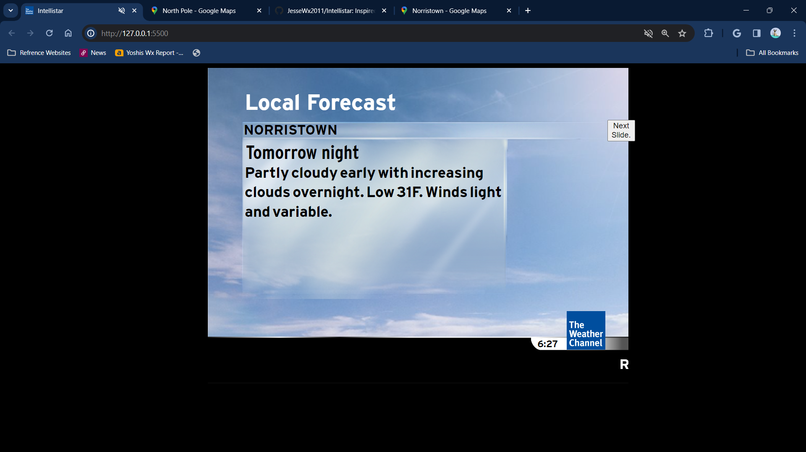
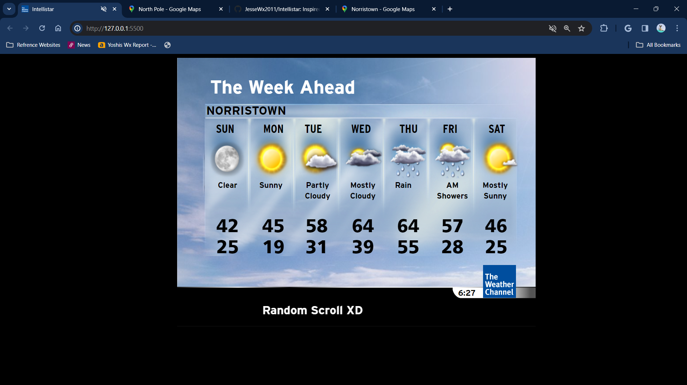

# Intellistar
Inspired by buffbears/weatherscan. This project was made by me.
 <h1 align="center">This is the intellistar project! Made by Jesse Hasty.•</h1>
 <b>Head over to <a href="https://github.com/JesseWx2011/Intellistar/blob/master/changelog.txt">The Changelog </a>for updates.</b>
<h1>Information</h1>

• This Project was started in Mid-February 2024.

• 2010 Icons are from buffbears/Weatherscan (The respitory that inspired this project.)

• I am the only one who contributed to this project.

# Instructions
<h2>1. Download the zip file. Click code, then download as zip file. It will most likely appear in your downloads folder</h2>

 
 <h2>2. Extract to a folder or directory.</h2>
 
 <h2>3. Head to the folder where you extracted your files.</h2>
  
 <h2>4. Head to config.js, you will need your latitude and longitude, and set all the other stuff in the Configuration. Includes music, language setting, and your custom marquee..</h2>
 
 <h2>5. Run index.html, and click the "Next Slide" button for the next segment.</h2>
  
  <h3 align="center">Screenshots :)</h3>
  

   
    
   
   
   
   
   
Note: Screenshots taken as of Version 1.1.5

  

