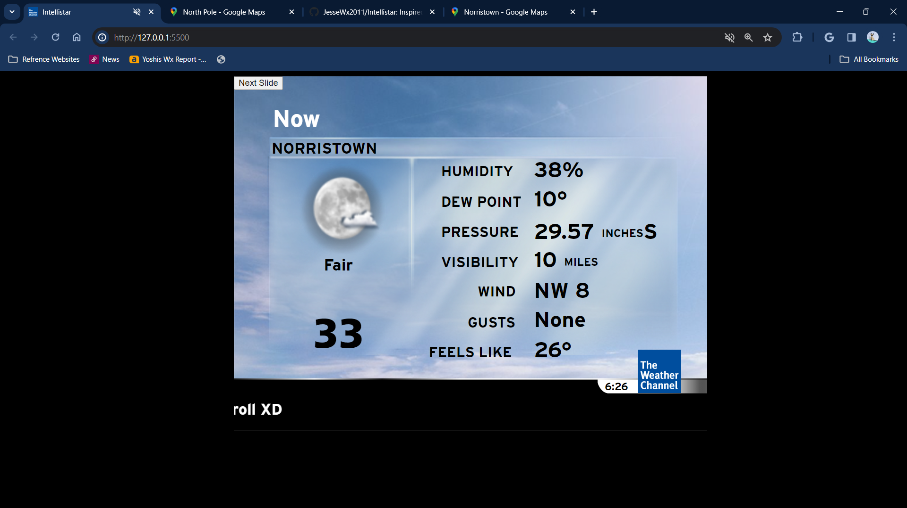
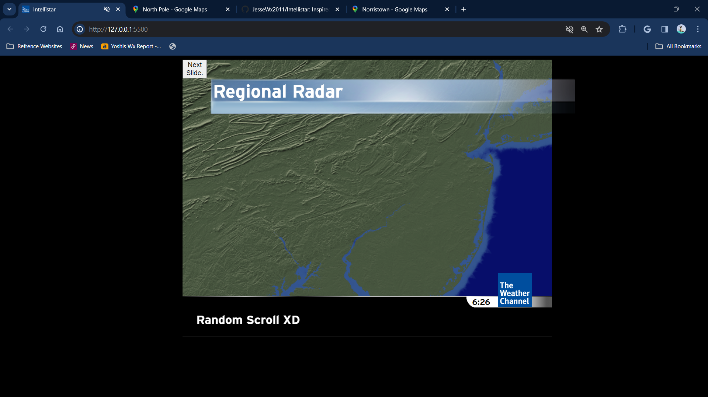
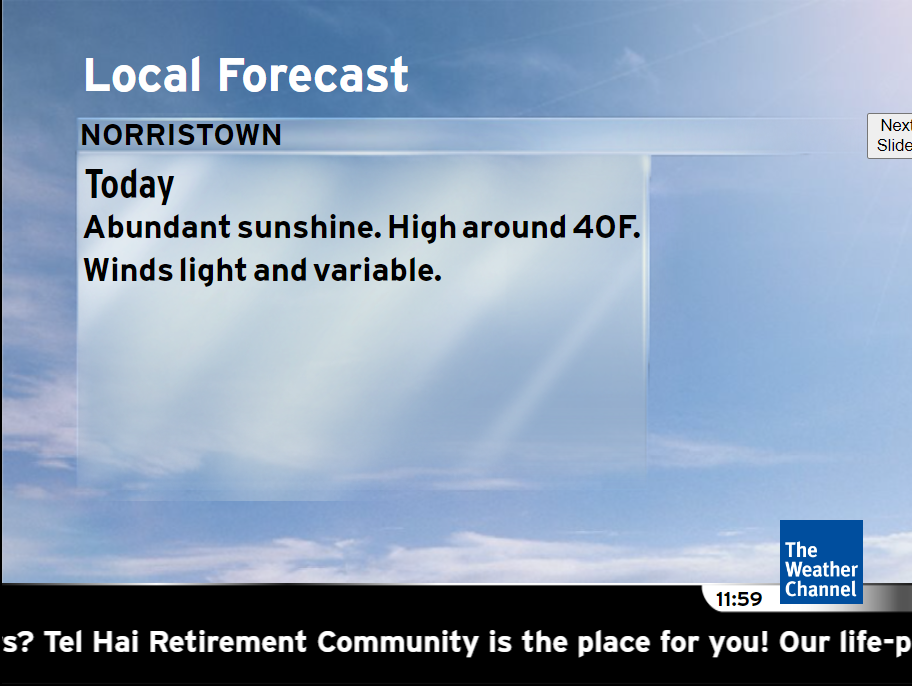
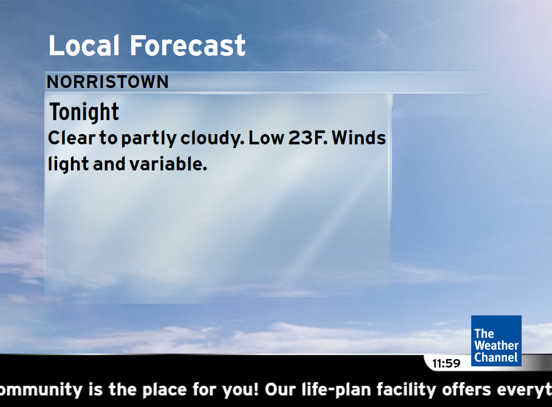

# Intellistar
Inspired by buffbears/weatherscan. This project was made by me.
 <h1 align="center">This is the intellistar project! Made by Jesse Hasty.</h1>

<h2>Instructions: </h2>
 <h2>1. Download the zip file. Click code, then download as zip file. It will most likely appear in your downloads folder</h2>
 <h2>2. Extract to a folder or directory.</h2>
 <h2>3. Head to config.js, you will need your latitude and longitude, and set all the other stuff in the Configuration. Includes music, language setting, and your custom marquee..</h2>
 <h2>4. Run index.html, and click the "Next Slide" button for the next segment.</h2>
  
  <h3 align="center">Screenshots :)</h3>
  

    
   
   
   
   
Note: Screenshots taken as of Version 1.0

  

